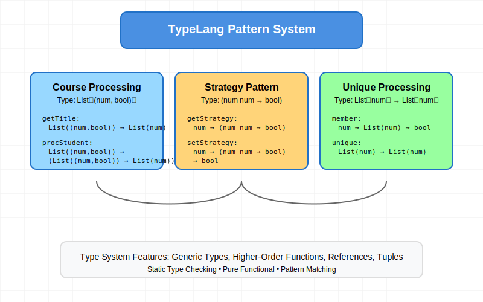

# TypeLang Pattern Implementations



A collection of TypeLang implementations demonstrating advanced type system features, pattern matching, and functional programming concepts. This repository includes type-safe implementations of common programming patterns.

## Components

### Course Processing (`course.scm`)
Type-safe list processing with tuples.

```typescript
// Type Signatures:
List<(num, bool)> -> List<num>
List<(num, bool)> -> (List<(num, bool)> -> List<num>) -> List<num>
```

Features:
- Generic list processing
- Higher-order functions
- Tuple type handling
- Type-safe transformations

### Strategy Pattern (`strategy.scm`)
Implementation of the Strategy pattern with type-safe function references.

```typescript
// Type Signatures:
num -> (num num -> bool)
num -> (num num -> bool) -> bool
num -> num -> num -> bool
```

Features:
- Mutable references with `Ref`
- Higher-order functions
- Function composition
- Dynamic strategy selection

### Unique Processing (`unique.scm`)
Type-safe list processing for removing duplicates.

```typescript
// Type Signatures:
num -> List<num> -> bool
num -> List<num> -> List<num>
List<num> -> List<num> -> List<num>
```

Features:
- Recursive type-safe list processing
- List manipulation
- Pure functional implementation
- Generic type constraints

## Implementation Details

### Type System Features Used
- Parametric polymorphism with `List<T>`
- Function types with multiple arguments
- Tuple types `(num, bool)`
- Reference types with `Ref`
- Higher-order function types

### Pattern Implementations
Each module demonstrates different TypeLang patterns:

1. **Course Processing**
   - List transformation with type preservation
   - Higher-order function composition
   - Tuple destructuring

2. **Strategy Pattern**
   - Mutable strategy references
   - Function type composition
   - Dynamic dispatch with type safety

3. **Unique Processing**
   - Pure functional list processing
   - Recursive type-safe operations
   - Stateless transformations

## Usage Examples

### Course Processing
```scheme
;; Process course enrollments
(define courseAndEnrollment : List<(num, bool)>
    (list : (num, bool)
        (cons 3420 #t)
        (cons 3090 #f)))
(getTitle courseAndEnrollment) ;; Returns: (3420 3090)
```

### Strategy Pattern
```scheme
;; Set and apply strategies
(setStrategy 1 
    (lambda (x : num y : num) 
        (> x y)))
(applyStrategy 1 10 20) ;; Returns: #f
```

### Unique Processing
```scheme
;; Remove duplicates from a list
(define numbers : List<num> 
    (list : num 1 2 2 3 3 4))
(unique numbers) ;; Returns: (1 2 3 4)
```

## Type System Details

The implementation leverages TypeLang's rich type system:

```typescript
// Generic List Type
List<T>

// Function Types
(T -> U)           // Simple function
(T -> U -> V)      // Curried function
((T -> U) -> V)    // Higher-order function

// Reference Types
Ref T              // Mutable reference

// Tuple Types
(T, U)             // 2-tuple
```

